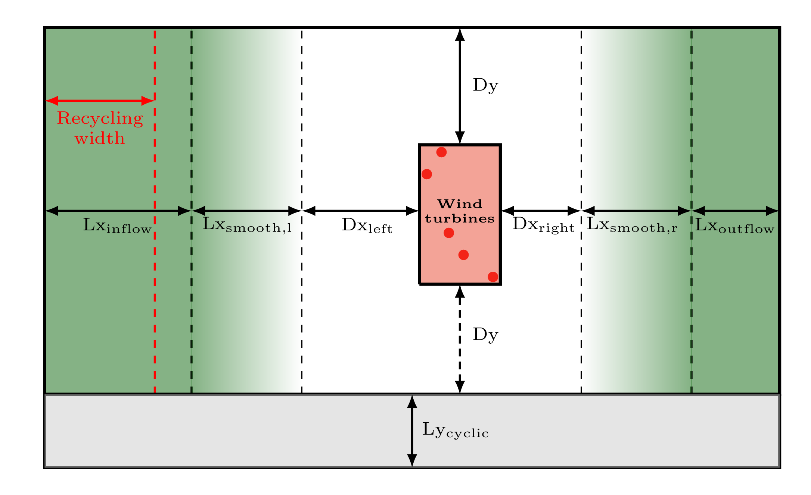

# ATOM - The Almighty TOpography Modifier (v2.0)

## Introduction
ATOM is able to pre-process natural complex topography data (ASCII-format), so it can be used in a large-eddy simulation with PALM (<https://palm.muk.uni-hannover.de/trac>) using non-cyclic boundary conditions and the turbulence recycling method.

The implementation of non-cyclic BC in PALM currently only allows for a mean flow from the left side to the right side of the model domain, which corresponds to the wind direction "west".
However in complex environments, the simulation of different wind direction is usually of particular interest to the modeler.
In these cases, the topography data needs to be rotated.
Furthermore, additional modifications, which are required by the non-cyclic BC, are applied.

ATOM supports a simple wind turbine interface in PALM and provides wind turbine/met mast coordinates converted into grid points.
At the given locations, profiles of u, v, and w are output so that the flow at the turbine sites/met masts can be easily examined in detail.

Furthermore, ATOM produces the entire INPUT-folder which is needed to run a simulation with PALM.
The main parameter file of PALM (`<case_name>_p3d`) is created using a user-defined template.

## Running ATOM
ATOM is written in Python. Simply run ATOM with
```bash
$ python3 atom.py
```
in the base folder. The configuration excecute `atom.ini` has to be in the same directory.

## Example
ATOM comes with a complete set of example files `example/atom.ini`, `example/example_template_p3d` and `example/example_topo`.
In order to run the example, copy the example `atom.ini` to the base folder and run ATOM with `$ python3 atom.py`.

## The configuration file 'atom.ini'
This file contains all steering parameters of ATOM which can be set by the user. It must be in the same directory as the program `atom.py`.

`case_name` is the name of your PALM simulation. All output files will include this name.

The boolean `plotting` enables plot of the topography at each modification stage (e.g., before rotation, after rotation, and so on).
The final topography data is plotted in any case.

The relative path to your topography data is set by `inputfile`. Additionally you have to specify the grid spacing of your data in meter (`dx_raw`), and the coordinate of the lower left corner of your data (`origin_x` and `origin_y`).

The relative path to the template of PALM's parameter is set via `p3d_template`.

The wind direction (in degrees) is set via `wdir`. The value of this variable determines if the topography data is rotated or not. A value of 270 represents the wind direction "west" (0: north, 90: east, 180: south).

The grid spacing used in your PALM simulation is set by `dx`.
The structure of PALM's model domain in case of complex terrain simulations is shown in the image below. Each length parameter has to be set by the user.


The desired numbers of grid points per processor of your PALM simulation are set via `ngp_x` (x-direction) and `ngp_y` (y-direction). These values are used to ensure that the final model domain size meets the restrictions of PALM's multigrid pressure solver.

Coordinates of wind turbines and met masts can be given in the `[WindTurbines]` and `[Masts]` sections. Make sure that you also specify the correct number of turbines (`n_turbines`) or masts (`n_masts`) in your simulation.

### Nesting method
A documentation will follow!

### 'atom.ini' example file
```config
[Name]
case_name = example

[Plotting]
plotting     = True
dpi_value    = 300

[InputData]
inputfile = example/example_topo.txt
dx_raw = 20.0
origin_x =  431410.
origin_y = 4733200.
p3d_template = example/example_template_p3d

[Meteorology]
wdir = 240.

[ModelDomain]
dx = 10
Dx_left         = 5000.
Dx_right        = 1000.
Dy              = 1000.
Lx_inflow       = 5000.
Lx_outflow      = 2500.
Lx_smooth_left  = 1000.
Lx_smooth_right = 1000.
Ly_cyclic       = 1000.

[Nesting]
nesting = False
dx_nest = 5
p3d_template_parent = templates/parent_p3d
p3d_template_nest = templates/nest_p3d

[ProcessorGrid]
ngp_x = 16
ngp_y = 16

[WindTurbines]
n_turbines = 3
coordinates_1 = [441375, 4744262]
coordinates_2 = [441612, 4743487]
coordinates_3 = [441811, 4742686]

[Masts]
n_masts = 2
coordinates_1 = [441400,4742534]
coordinates_2 = [442403,4742761]
```
